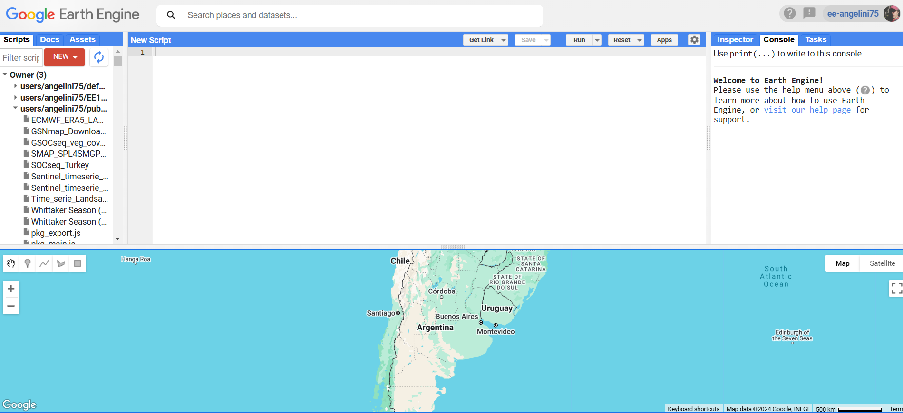
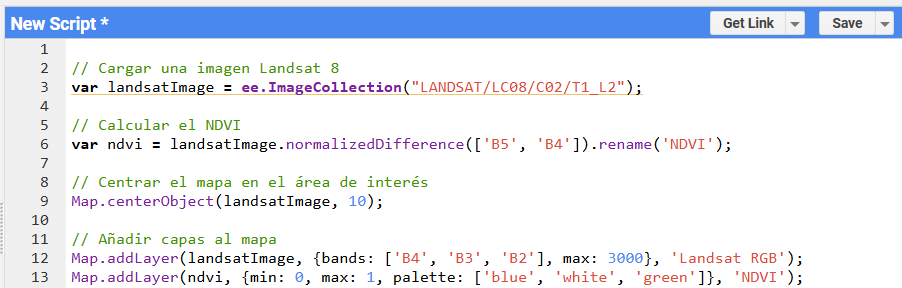
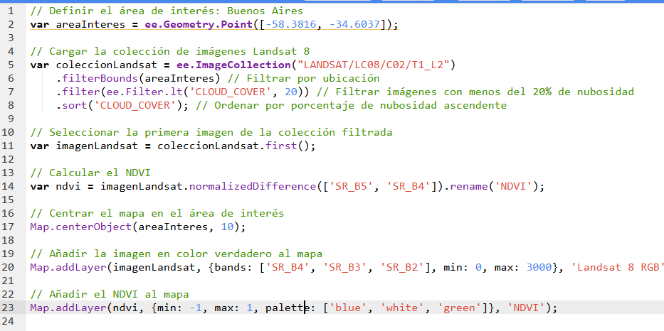

# Introducción 

## Google Earth Engine

### ¿Qué es Google Earth Engine?
Google Earth Engine (GEE) es una plataforma revolucionaria para el análisis y procesamiento de datos geoespaciales. Alojada en la nube, combina un vasto catálogo de datos satelitales con una infraestructura computacional diseñada para manejar cálculos a gran escala. Su propósito principal es permitir a investigadores, académicos y profesionales abordar desafíos complejos relacionados con el medio ambiente y la gestión de recursos naturales.

Lo que hace único a GEE no es solo su capacidad para procesar terabytes de datos en segundos, sino también la accesibilidad que brinda. Desde un navegador web, puedes analizar datos históricos y actuales, crear visualizaciones interactivas y compartir tus resultados con un solo clic.

Para comenzar a utilizar Google Earth Engine (GEE), es fundamental crear una cuenta y configurar un proyecto asociado. A continuación, se detallan los pasos necesarios:

### Creación de una Cuenta en Google Earth Engine

1. **Accede a la Página de Registro:**
   - Visita la página oficial de registro de GEE:
   - Inicia sesión con tu cuenta de Google.

2. **Completa el Formulario de Solicitud:**
   - Proporciona la información requerida, como tu nombre, organización y una breve descripción de cómo planeas utilizar GEE.
   - Acepta los términos de servicio.

3. **Espera la Aprobación:**
   - Tras enviar la solicitud, recibirás un correo electrónico de confirmación una vez que tu cuenta haya sido aprobada.

### Creación de un Proyecto en Google Earth Engine

Una vez que tu cuenta esté activa, es recomendable crear un proyecto para organizar y gestionar tus recursos de manera eficiente.

1. **Accede a Google Earth Engine:**
   - Dirígete al [Editor de Código de GEE](https://code.earthengine.google.com/) e inicia sesión con tu cuenta aprobada.

2. **Crea un Proyecto en Google Cloud Platform (GCP):**
   - GEE utiliza proyectos de GCP para la gestión de recursos.
   - Accede a [Google Cloud Console](https://console.cloud.google.com/).
   - En el menú superior, selecciona o crea un nuevo proyecto:
     - Haz clic en el selector de proyectos y luego en "Nuevo Proyecto".
     - Asigna un nombre al proyecto y, si es necesario, selecciona una organización o ubicación de facturación.
     - Haz clic en "Crear" y espera a que se configure el proyecto.

3. **Asocia el Proyecto de GCP con GEE:**
   - En el Editor de Código de GEE, ve a la sección "Assets" (Activos).
   - Haz clic en "Create a new asset" (Crear un nuevo activo) y selecciona "Cloud Project".
   - Ingresa el ID del proyecto de GCP que creaste previamente.
   - Sigue las indicaciones para vincular ambos servicios.

### Consideraciones Adicionales

- **Permisos y Facturación:**
  - Asegúrate de que tu proyecto de GCP tenga la facturación habilitada, aunque GEE ofrece una cuota gratuita.
  - Configura los permisos adecuados para controlar quién puede acceder y modificar tu proyecto.

- **Organización de Recursos:**
  - Utiliza el proyecto para almacenar y gestionar tus scripts, datos y otros recursos relacionados con tus análisis en GEE.

Para una guía visual y detallada sobre la creación de una cuenta en Google Earth Engine, puedes consultar el siguiente video:

```{=html}
<iframe width="640" height="400" src="https://www.youtube.com/embed/wGhgqj5_udg?si=HpKDRPgakQLDVsut" title="YouTube video player" frameborder="0" allow="accelerometer; autoplay; clipboard-write; encrypted-media; gyroscope; picture-in-picture; web-share" referrerpolicy="strict-origin-when-cross-origin" allowfullscreen></iframe>
```

### Bondades de Google Earth Engine
1. Escalabilidad sin precedentes: GEE permite analizar áreas tan pequeñas como una parcela agrícola o tan grandes como continentes enteros, sin preocuparte por la capacidad de tu computadora local.
2. Biblioteca global de datos: Incluye imágenes de satélites como Landsat y Sentinel, modelos climáticos, mapas de uso del suelo y mucho más.
3. Rapidez y eficiencia: Cálculos que podrían tardar horas en otras plataformas aquí se ejecutan en minutos, aprovechando la infraestructura de Google.
4. Facilidad de colaboración: Todo análisis puede compartirse mediante scripts reproducibles, lo que fomenta la transparencia y la colaboración científica.

---

### Partes esenciales de la plataforma

Google Earth Engine (GEE) cuenta con una interfaz intuitiva y poderosa diseñada para facilitar el análisis de datos geoespaciales. A continuación, se destacan las partes esenciales que hacen de esta plataforma una herramienta indispensable para investigadores y profesionales.

#### Interfaz de Usuario

La imagen \@ref(fig:gee-interface) muestra la interfaz principal de Google Earth Engine. Esta incluye:

```{r gee-interface, echo=FALSE, fig.cap="Interfaz principal de Google Earth Engine.", out.width="100%"}

```

1. Panel de Scripts:
   - Ubicado en la parte izquierda, donde puedes crear, organizar y acceder a tus scripts. Los scripts se guardan en la nube, lo que permite acceder a ellos desde cualquier dispositivo con conexión a internet.

2. Editor de Código:
   - Situado al centro de la pantalla, este es el espacio principal para escribir y ejecutar scripts en JavaScript. Los resultados de tus análisis se reflejan en tiempo real en el mapa.

3. Consola:
   - En el panel derecho, la consola permite inspeccionar resultados, visualizar salidas intermedias de tus scripts y depurar errores.

4. Mapa Interactivo:
   - La sección inferior muestra un mapa interactivo que permite visualizar datos satelitales, análisis y resultados generados. Incluye herramientas básicas como zoom, cambio de capas entre satélite y mapa base, y un inspector para obtener información detallada sobre ubicaciones específicas.

#### Catálogo de Datos
El Catálogo de Datos de GEE proporciona acceso a una vasta biblioteca de conjuntos de datos globales, incluyendo:

- Imágenes Satelitales:
  - Series temporales de Landsat, Sentinel y MODIS, ideales para monitoreo ambiental, análisis de cambios y modelado climático.
- Mapas Temáticos:
  - Cobertura del suelo, elevación, datos climáticos y más.
- Datos Personalizados:
  - Posibilidad de cargar tus propios datos vectoriales o ráster para análisis específicos.

#### API de Earth Engine
GEE también ofrece una API en Python, que extiende sus capacidades al integrarse en flujos de trabajo personalizados. Esto permite combinar la potencia de GEE con bibliotecas como `pandas` y `matplotlib` para análisis y visualizaciones adicionales.

#### Visualización Interactiva
La combinación del editor de código y el mapa interactivo permite generar visualizaciones en tiempo real. Estas herramientas no solo son útiles para analizar datos, sino también para comunicar resultados de manera efectiva.

---

### ¿Por qué es importante esta plataforma?
La interfaz y las herramientas integradas en Google Earth Engine hacen que sea accesible para usuarios con diferentes niveles de experiencia. Desde investigadores académicos hasta gestores ambientales, GEE reduce las barreras técnicas al análisis de grandes volúmenes de datos espaciales, todo desde un navegador web.


---

### Condiciones de uso
GEE está disponible de forma gratuita para fines académicos y no comerciales. Sin embargo, requiere un registro previo y aprobación. Al registrarte, se espera que describas brevemente tu propósito de uso. Aunque la plataforma es accesible, existen ciertos límites en el procesamiento y la descarga de datos, diseñados para garantizar un uso justo.

---

### Ejemplo de las capacidades de GEE
Una de las características más destacadas de GEE es su capacidad para analizar grandes volúmenes de datos históricos. Por ejemplo, un estudio podría explorar cómo ha cambiado la cobertura forestal en los últimos 30 años utilizando imágenes Landsat. A través de funciones integradas, como la creación de índices de vegetación (NDVI), es posible identificar áreas donde la deforestación ha avanzado o incluso mapear patrones de regeneración natural.


## Introducción a JavaScript

JavaScript es el lenguaje principal utilizado en Google Earth Engine (GEE). Si nunca has trabajado con un lenguaje de programación, no te preocupes. A continuación, exploraremos los elementos básicos de JavaScript, cómo identificarlos visualmente en el Editor de Código de GEE y cómo entender la estructura de un script.

---

### Elementos básicos de un script de JavaScript

Cuando escribes un script en JavaScript, estás combinando varios elementos que trabajan juntos para procesar datos y realizar tareas. Aquí te explicamos los componentes clave:

La imagen \@ref(fig:script) muestra el script de la manera que se vería en GEE.

```{r script, echo=FALSE, fig.cap="Script de Google Earth Engine.", out.width="100%"}

```

1. Variables  
   - Qué son: Las variables almacenan datos, como números, texto o resultados de operaciones.
   - Cómo se declaran: Usamos la palabra clave `var`.
   - Cómo se ven en GEE: Aparecen en color **negro** en el Editor de Código.  
   Ejemplo:
   ```javascript
   var x = 5; // x almacena el número 5
   var texto = "Hola mundo"; // texto almacena una cadena de texto
   ```

2. Funciones  
   - Qué son: Bloques de código que realizan una tarea específica y pueden reutilizarse.
   - Cómo se ven en GEE: Aparecen en color **negro** cuando las defines, y en color **violeta** cuando usas funciones predefinidas de GEE.  
   Ejemplo:
   ```javascript
   function saludar(nombre) {
       return "Hola, " + nombre; // Esta función retorna un saludo personalizado
   }
   ```

3. Operadores  
   - Qué son: Símbolos que realizan operaciones entre valores, como `+` (suma) o `=` (asignación).
   - Cómo se ven en GEE: En color negro y texto en negrita.
   Ejemplo:
   ```javascript
   var suma = 5 + 3; // El resultado es 8
   ```

4. Comentarios  
   - Qué son: Notas en el código que no se ejecutan pero ayudan a explicar lo que hace el script.
   - Cómo se ven en GEE: En verde.
   Ejemplo:
   ```javascript
   // Este es un comentario de una línea
   ```
5. Numeros y textos
   - Qué son: son los valores que requieren los argumentos de las funciones.
   - Cómo se ven en GEE: Números se ven azul y valores alfanuméricos se ven en rojo.
   Ejemplo:
   ```javascript
   var a = ['B8A', 'B4']
   var b = 5
   ```
   
---

### Entendiendo la sintaxis en JavaScript y Google Earth Engine

Antes de trabajar con un script en Google Earth Engine (GEE), es importante entender cómo está estructurada la sintaxis y qué significan los diferentes elementos que la componen. En esencia, un script es una serie de instrucciones que la computadora ejecuta secuencialmente, y en GEE estas instrucciones están diseñadas para trabajar con datos geoespaciales.

---

### Elementos clave de la sintaxis

1. **Variables:**  
   Las variables son contenedores donde almacenamos datos o referencias a objetos. En JavaScript, usamos la palabra clave `var` para declararlas. Por ejemplo:  
   ```javascript
   var areaInteres = ee.Geometry.Point([-58.3816, -34.6037]);
   ```
   Aquí, `areaInteres` es una variable que contiene un punto geográfico (una coordenada).

2. **Funciones:**  
   Las funciones son bloques de código que realizan una tarea específica. Algunas funciones están predefinidas en GEE, como `ee.Geometry.Point`, mientras que otras pueden ser definidas por el usuario.  
   ```javascript
   var ndvi = imagenLandsat.normalizedDifference(['SR_B5', 'SR_B4']);
   ```
   En este caso, `normalizedDifference` es una función que calcula un índice NDVI usando dos bandas de la imagen.

3. **Puntos (`.`):**  
   En JavaScript y GEE, el punto se utiliza para acceder a propiedades o métodos de un objeto. Por ejemplo:  
   ```javascript
   ee.ImageCollection("LANDSAT/LC08/C02/T1_L2").filterBounds(areaInteres);
   ```
   Aquí, `filterBounds` es un método aplicado al objeto `ee.ImageCollection`.

4. **Paréntesis (`()`):**  
   Los paréntesis se utilizan para ejecutar funciones o métodos. Dentro de los paréntesis, podemos pasar argumentos que especifican cómo se debe ejecutar la función. Por ejemplo:  
   ```javascript
   Map.centerObject(areaInteres, 10);
   ```
   La función `centerObject` toma dos argumentos: un objeto geográfico y un nivel de zoom.

5. **Corchetes (`[]`):**  
   Los corchetes se usan para trabajar con listas o conjuntos de datos. Por ejemplo:  
   ```javascript
   ['SR_B5', 'SR_B4'];
   ```
   Este conjunto de bandas indica las bandas que se usarán para calcular el NDVI.

6. **Llaves (`{}`):**  
   Las llaves se usan para definir bloques de código (como en funciones) o para especificar opciones dentro de un método. Por ejemplo:  
   ```javascript
   {bands: ['SR_B4', 'SR_B3', 'SR_B2'], min: 0, max: 3000};
   ```
   Este bloque especifica las bandas y los rangos para visualizar una imagen en color verdadero.

7. **Comentarios (`//`):**  
   Los comentarios son líneas de texto que no se ejecutan. Se utilizan para explicar el código y facilitar su comprensión.  
   ```javascript
   // Este es un comentario.
   ```

---

### Cómo leer un script

La clave para entender un script es identificar la secuencia lógica de sus elementos:

1. **Define variables:** Aquí se almacenan los datos o configuraciones necesarias para el análisis.  
2. **Aplica funciones y métodos:** Estas instrucciones procesan los datos almacenados en las variables.  
3. **Agrega visualizaciones:** Finalmente, los resultados del análisis se muestran en el mapa.

---

### Ejemplo básico desglosado

Tomemos esta línea de código como ejemplo:  
```javascript
var ndvi = imagenLandsat.normalizedDifference(['SR_B5', 'SR_B4']).rename('NDVI');
```

- `imagenLandsat`: Es una variable que contiene una imagen satelital.
- `normalizedDifference`: Es un método que calcula la diferencia normalizada entre las bandas `SR_B5` y `SR_B4`.
- `rename`: Cambia el nombre de la banda resultante a `'NDVI'`.
- `ndvi`: Es la variable donde se almacena el resultado.

### El uso de la función `print`

En Google Earth Engine (GEE), la función `print` es una herramienta muy útil para entender y depurar tu código, especialmente si estás empezando a programar. Su propósito principal es mostrar información en la consola del editor de código para que puedas verificar que los datos o las operaciones están funcionando como esperas.

##### Cómo usar `print`
La sintaxis básica de `print` es la siguiente:
```javascript
print(nombreVariable, 'Descripción opcional');
```
- **`nombreVariable`:** Es el objeto o valor que deseas inspeccionar.  
- **`Descripción opcional`:** Es un texto que ayuda a identificar qué se está mostrando en la consola (no es obligatorio, pero es recomendable).

---

#### Ejemplo de uso
Supongamos que quieres asegurarte de que la imagen de Landsat seleccionada cumple con el filtro de nubosidad aplicado. Puedes usar `print` para mostrar la imagen y explorar sus propiedades:

```javascript
// Verificar la imagen seleccionada
print(imagenLandsat, 'Primera imagen de la colección filtrada');
```

Esto mostrará información sobre `imagenLandsat` en la consola, como su fecha de adquisición, las bandas disponibles y los metadatos asociados. También puedes imprimir otros objetos como geometrías, colecciones de imágenes o valores calculados.

---

#### Depurando con `print`
Si estás calculando el NDVI, puedes verificar que el resultado es correcto imprimiendo el objeto resultante:
```javascript
// Verificar el cálculo del NDVI
print(ndvi, 'NDVI calculado');
```
Esto te permite inspeccionar las propiedades del NDVI y confirmar que la banda fue calculada correctamente.

---

#### ¿Por qué es útil para principiantes?

1. **Comprensión de objetos:**  
   Si no estás seguro de cómo es un objeto en GEE (como una imagen, una colección o un valor escalar), `print` te permite explorarlo visualmente.

2. **Rastreo de errores:**  
   Si algo no funciona en tu script, puedes usar `print` en diferentes partes del código para verificar dónde se produce el error.

3. **Validación paso a paso:**  
   `print` ayuda a validar que cada paso del análisis está generando los resultados esperados antes de continuar con los pasos siguientes.

4. **Exploración de datos:**  
   Con `print`, puedes inspeccionar propiedades de las imágenes o colecciones, como las bandas disponibles, los rangos de valores y los metadatos.

---

#### Consejo para usar `print` eficientemente
Aunque es útil, evita abusar de `print` en scripts largos o complejos, ya que puede generar demasiada información en la consola. Usa descripciones claras para cada línea de `print` y borra las que ya no necesites una vez que hayas validado tu código.

---

### Un primer script en Google Earth Engine

Este script simple en Google Earth Engine carga una colección de imágenes Landsat 8, filtra aquellas con menos del 20% de nubosidad, selecciona la primera imagen disponible, calcula el NDVI y visualiza tanto la imagen original como el NDVI en el mapa.

```javascript
// Definir el área de interés: Buenos Aires
var areaInteres = ee.Geometry.Point([-58.3816, -34.6037]);

// Cargar la colección de imágenes Landsat 8
var coleccionLandsat = ee.ImageCollection("LANDSAT/LC08/C02/T1_L2")
    .filterBounds(areaInteres) // Filtrar por ubicación
    .filter(ee.Filter.lt('CLOUD_COVER', 20)) // Filtrar imágenes con menos del 20% de nubosidad
    .sort('CLOUD_COVER'); // Ordenar por porcentaje de nubosidad ascendente

// Seleccionar la primera imagen de la colección filtrada
var imagenLandsat = coleccionLandsat.first();

// Calcular el NDVI
var ndvi = imagenLandsat.normalizedDifference(['SR_B5', 'SR_B4']).rename('NDVI');

// Centrar el mapa en el área de interés
Map.centerObject(areaInteres, 10);

// Añadir el NDVI al mapa
Map.addLayer(ndvi, {min: -0.1, max: 0.4, palette: ['blue', 'brown', 'yellow', 'green']}, 'NDVI');
```

---


```{r script2, echo=FALSE, fig.cap="Captura de pantalla del script.", out.width="100%"}

```


#### Analizando el script

1. **Comentarios:**  
   Las líneas que comienzan con `//` explican lo que hace cada parte del código. Estas no son ejecutadas y ayudan a comprender el propósito de cada sección.

2. **Variables:**  
   - `areaInteres`: Define un punto geográfico que representa a Buenos Aires.  
   - `coleccionLandsat`: Contiene la colección de imágenes Landsat 8 que cumplen con los filtros aplicados.  
   - `imagenLandsat`: La primera imagen de la colección filtrada.  
   - `ndvi`: Almacena el resultado del cálculo del Índice de Vegetación de Diferencia Normalizada (NDVI).  

3. **Funciones y métodos:**  
   - `ee.Geometry.Point`: Crea un punto geográfico para definir el área de interés.  
   - `filterBounds`: Filtra imágenes que cubren el área de interés.  
   - `filter`: Filtra imágenes con menos del 20% de nubosidad según la propiedad `CLOUD_COVER`.  
   - `sort`: Ordena las imágenes por el porcentaje de nubosidad en orden ascendente.  
   - `normalizedDifference`: Calcula el NDVI utilizando las bandas `'SR_B5'` (infrarrojo cercano) y `'SR_B4'` (rojo).  
   - `rename`: Renombra la banda generada como `'NDVI'`.  
   - `Map.centerObject`: Centra el mapa en el área de interés.  
   - `Map.addLayer`: Añade una capa visual al mapa.  

4. **Visualización interactiva:**  
   - **RGB:** Utiliza las bandas `'SR_B4'`, `'SR_B3'` y `'SR_B2'` para generar una visualización en color verdadero.  
   - **NDVI:** Representa los valores del NDVI con una paleta de colores que varía de azul (bajos valores de NDVI) a verde (altos valores de NDVI).

---

#### Colores en el Editor de Código de GEE

- **Negro:** Variables como `coleccionLandsat` y `ndvi`.  
- **Violeta:** Métodos y funciones predefinidas como `filterBounds`, `normalizedDifference` y `addLayer`.  
- **Negro:** Funciones definidas por el usuario (en este caso, no se utilizan).  
- **Verde:** Comentarios que explican el código.  
- **Negro en negrita:** Operadores como `=` para asignaciones.  

---

### Pregunta para el lector

¿Qué resultado obtendrías si cambias el filtro de nubosidad (`CLOUD_COVER`) al 50%? ¿Cómo impactaría esto en la calidad visual de las imágenes seleccionadas?


### Ejercicio
Entendido. Vamos a simplificar el ejercicio y proporcionar fragmentos de código con partes faltantes para que los estudiantes los completen. A continuación, se detallan los pasos básicos para crear un script en Google Earth Engine (GEE):

#### Pasos para crear un script en GEE

1. **Definir el Área de Interés (AOI):**
   - Utiliza las herramientas de dibujo en el Editor de Código de GEE para delinear tu área de interés.
   - Alternativamente, puedes definir el AOI programáticamente utilizando coordenadas geográficas.

2. **Seleccionar una Colección de Datos:**
   - Accede al Catálogo de Datos de GEE para explorar las colecciones disponibles.
   - Selecciona una colección que se ajuste a tus necesidades, como imágenes satelitales recientes.

3. **Filtrar la Colección por el Área de Interés y Fecha:**
   - Aplica filtros espaciales y temporales para restringir la colección a tu AOI y al período de tiempo deseado.

4. **Obtener la Imagen Más Reciente:**
   - Ordena la colección filtrada por fecha de adquisición en orden descendente.
   - Selecciona la primera imagen de la colección ordenada, que corresponderá a la más reciente.

5. **Visualizar la Imagen en el Mapa:**
   - Añade la imagen seleccionada al mapa utilizando parámetros de visualización adecuados.

#### Fragmentos de código para completar

A continuación, se proporcionan fragmentos de código con partes faltantes que deberás completar:

```javascript
// 1. Definir el Área de Interés (AOI)
// Completa la línea siguiente para definir un punto de coordenadas
var aoi = ee.Geometry.Point([/* longitud */, /* latitud */]);

// 2. Seleccionar una Colección de Datos
// Completa con el ID de la colección deseada
var collection = ee.ImageCollection('/* ID de la colección */');

// 3. Filtrar la Colección por el Área de Interés y Fecha
// Completa con las fechas de inicio y fin en formato 'YYYY-MM-DD'
var filteredCollection = collection
  .filterBounds(aoi)
  .filterDate('/* fecha de inicio */', '/* fecha de fin */');

// 4. Obtener la Imagen Más Reciente
// Completa para ordenar por fecha en orden descendente y seleccionar la primera imagen
var latestImage = filteredCollection
  .sort('system:time_start', /* orden descendente */)
  .first();

// 5. Visualizar la Imagen en el Mapa
// Completa para centrar el mapa en el AOI con un nivel de zoom adecuado
Map.centerObject(aoi, /* nivel de zoom */);
// Completa con las bandas y parámetros de visualización adecuados
Map.addLayer(latestImage, {bands: [/* bandas */], min: /* valor mínimo */, max: /* valor máximo */}, 'Imagen más reciente');
```

#### Indicaciones para completar los fragmentos

- **Definir el AOI:**
  - Sustituye `/* longitud */` y `/* latitud */` por las coordenadas numéricas correspondientes a tu área de interés.

- **Seleccionar la Colección de Datos:**
  - Reemplaza `'/* ID de la colección */'` con el ID de la colección de datos que deseas utilizar. Por ejemplo, para Landsat 8 Collection 2, Nivel 2, el ID es `'LANDSAT/LC08/C02/T1_L2'`.

- **Filtrar la Colección por Fecha:**
  - Sustituye `'/* fecha de inicio */'` y `'/* fecha de fin */'` por las fechas deseadas en formato `'YYYY-MM-DD'`.

- **Obtener la Imagen Más Reciente:**
  - Para ordenar en orden descendente, utiliza `false` en `/* orden descendente */`.

- **Visualizar la Imagen en el Mapa:**
  - Sustituye `/* nivel de zoom */` por un número que represente el nivel de acercamiento deseado (por ejemplo, `10`).
  - Reemplaza `/* bandas */` con las bandas que deseas visualizar (por ejemplo, `['SR_B4', 'SR_B3', 'SR_B2']` para una imagen en color verdadero).
  - Sustituye `/* valor mínimo */` y `/* valor máximo */` por los valores de visualización adecuados para las bandas seleccionadas (por ejemplo, `0` y `3000`, respectivamente).

#### Recursos adicionales

Para ayudarte a completar estos fragmentos de código, puedes consultar los siguientes recursos:

- **Tutoriales de Google Earth Engine:**
  - [Introducción a la API de JavaScript de Earth Engine](https://developers.google.com/earth-engine/tutorials/tutorial_api_01)

- **Recopilatorio de scripts para Google Earth Engine:**
  - [Gis&Beers - Scripts para Google Earth Engine](https://www.gisandbeers.com/scripts-para-google-earth-engine/)

## Introducción a ChatGPT

Aprender un nuevo lenguaje de programación puede ser un desafío significativo. La curva de aprendizaje es pronunciada y dominar herramientas como Google Earth Engine (GEE) requiere tiempo y práctica. Sin embargo, los Grandes Modelos de Lenguaje (LLM, por sus siglas en inglés) pueden ser aliados valiosos en este proceso.

### ¿Qué son los Grandes Modelos de Lenguaje (LLM)?

Los Grandes Modelos de Lenguaje (LLM, por sus siglas en inglés), son sistemas avanzados de inteligencia artificial diseñados para procesar y generar lenguaje humano con gran precisión. Estos modelos, entrenados con enormes volúmenes de texto, pueden llevar a cabo tareas que van desde la generación de contenido hasta el soporte en actividades técnicas complejas, como la programación. Entre los LLM más conocidos se encuentra ChatGPT, desarrollado por OpenAI, una herramienta que destaca por su capacidad para mantener conversaciones, proporcionar explicaciones detalladas y asistir en la resolución de problemas.

Para aprovechar al máximo las capacidades de ChatGPT en tus proyectos de programación, es fundamental crear una cuenta y familiarizarte con su interfaz gráfica. A continuación, te proporcionamos una guía paso a paso para registrarte y una breve descripción de la interfaz de usuario.

### Creación de una Cuenta en ChatGPT

1. **Accede al Sitio Web Oficial:**  
   Dirígete a [chat.openai.com](https://chat.openai.com/).

2. **Registro:**  
   Haz clic en "Sign Up" (Registrarse).

3. **Proporciona tu Correo Electrónico:**  
   Ingresa una dirección de correo electrónico válida y crea una contraseña segura.

4. **Verificación:**  
   Revisa tu correo electrónico y sigue el enlace de verificación enviado por OpenAI.

5. **Completa tu Perfil:**  
   Una vez verificada tu cuenta, proporciona la información adicional solicitada para completar tu perfil.


### Explorando la Interfaz de ChatGPT


Una vez que hayas iniciado sesión, te encontrarás con una interfaz sencilla y funcional como la de la figura \@ref(fig:chatgpt):

```{r chatgpt, echo=FALSE, fig.cap="Interfaz principal de ChatGPT.", out.width="100%"}
knitr::include_graphics("figuras/ChatGPT.png")
```


- **Barra de Navegación Superior:**  
  Incluye opciones como "New Chat" para iniciar una nueva conversación y un menú desplegable para acceder a tu cuenta y configuraciones.

- **Área Principal de Conversación:**  
  Aquí se muestran tus interacciones con ChatGPT. Las respuestas del modelo aparecen en burbujas de texto, facilitando la lectura y seguimiento de la conversación.

- **Campo de Entrada de Texto:**  
  Ubicado en la parte inferior, permite escribir tus consultas o prompts. Una vez redactada tu pregunta, presiona "Enter" o haz clic en el botón de envío para recibir una respuesta.

- **Historial de Conversaciones:**  
  En el panel lateral izquierdo, puedes acceder a tus conversaciones anteriores, lo que facilita retomar discusiones o revisar información proporcionada previamente.

Familiarizarte con esta interfaz te permitirá interactuar de manera más eficiente con ChatGPT, optimizando tu experiencia en el desarrollo de proyectos de programación y otras tareas. 

#### Aplicaciones de ChatGPT en Programación

ChatGPT ha demostrado ser una herramienta versátil y eficaz en el ámbito de la programación, ofreciendo una amplia variedad de funcionalidades que simplifican y optimizan el proceso de desarrollo de software:

- **Generación de Código:** A partir de una descripción en lenguaje natural, ChatGPT puede generar fragmentos de código funcionales, ayudando a materializar ideas rápidamente. 

- **Depuración y Diagnóstico de Errores:** Identifica errores en el código y sugiere correcciones detalladas, facilitando la depuración incluso para quienes están aprendiendo.

- **Conversión entre Lenguajes de Programación:** Traduce código de un lenguaje a otro, permitiendo a los desarrolladores trabajar de manera más eficiente en entornos multiplataforma.

- **Optimización de Código:** Sugiere mejoras para hacer que el código sea más eficiente, legible y rápido.

- **Exploración de Nuevas Tecnologías:** Proporciona guías y explicaciones claras sobre conceptos o herramientas que un usuario está aprendiendo, desglosando la información en pasos manejables.

Es crucial recordar que, aunque ChatGPT es extremadamente útil, su asistencia no reemplaza la necesidad de comprender los fundamentos de la programación. El usuario debe revisar críticamente las soluciones sugeridas para garantizar que sean precisas y relevantes para su contexto.

#### Utilidad de ChatGPT en el Contexto de este Curso

En el marco del aprendizaje de Google Earth Engine (GEE), ChatGPT se convierte en un aliado indispensable, especialmente para quienes están comenzando a trabajar con JavaScript o con GEE. Sus aplicaciones específicas incluyen:

- **Soporte en Escritura de Código:** ChatGPT puede generar ejemplos y explicar fragmentos de código en JavaScript relacionados con GEE, ayudando a comprender cómo interactuar con la plataforma.

- **Resolución de Conceptos Complejos:** Facilita la comprensión de temas avanzados al responder preguntas relacionadas con la funcionalidad de GEE y su aplicación.

- **Recomendaciones para Mejorar el Trabajo:** Proporciona consejos prácticos sobre cómo estructurar y optimizar scripts, asegurando que el código sea eficiente y claro.

Con estas herramientas, ChatGPT no solo acelera el aprendizaje, sino que también actúa como un recurso constante para superar obstáculos técnicos a lo largo del curso.


Entendido. Aquí tienes la versión actualizada con títulos y subtítulos claros, sin los asteriscos, y con un uso más moderado de los bullet points.

---

### Ingeniería de Prompts

La ingeniería de prompts es el arte de formular preguntas efectivas para obtener respuestas precisas y útiles de los Grandes Modelos de Lenguaje (LLM) como ChatGPT. Aunque parece sencillo, el verdadero desafío radica en estructurar el flujo de trabajo de manera eficiente para que las respuestas se adapten exactamente a tus necesidades.

Esta sección se enfoca en la forma más eficaz de utilizar ChatGPT en el contexto de Google Earth Engine (GEE) y JavaScript.

:::: {.blackbox data-latex=""}
::: {.center data-latex=""}
**ATENCION!**
:::
Usa los prompts de ejemplos que se dan en las siguientes subsecciones en ChatGPT y observa los resultados, al final hay algunas preguntas al respecto.
::::

#### Claridad y especificidad

Cuanto más claro y específico sea tu prompt, más precisa será la respuesta. Evita los términos generales y proporciona instrucciones concretas.

Ejemplo de mala formulación del prompt:

```
Explícame GEE.
```
Problemas:
- No se sabe qué aspecto de GEE se desea comprender (¿la plataforma? ¿su arquitectura? ¿un concepto específico?).
- La respuesta puede ser demasiado general.

Ejemplo de buena formulación del prompt:
```
Explícame la diferencia entre `ee.ImageCollection` y `ee.Image` en Google Earth Engine, con ejemplos de uso.
```
Razones por las que es un buen prompt:
- Delimita claramente el tema de la consulta: "diferencia entre `ee.ImageCollection` y `ee.Image`".
- Se solicita una explicación con ejemplos, lo que hace la respuesta más valiosa.


#### Estrategias de Contexto y Formato

Para que ChatGPT entienda mejor la consulta, incluye información de fondo que permita al modelo responder de forma más específica.

Ejemplo sin contexto:
```
Corrige este código:
var imagen = ee.ImageCollection("Landsat");
```
Problemas:
- No se especifica qué se espera corregir (¿errores de sintaxis, lógica, eficiencia?).
- La colección "Landsat" no es válida en GEE. El ID correcto sería 'LANDSAT/LC08/C02/T1_L2'.

Ejemplo con contexto:
```
Este código lanza un error en Google Earth Engine. Necesito que lo corrijas y me expliques la razón del error. El objetivo es cargar imágenes de Landsat 8 y calcular el NDVI. Aquí está el código:

var imagen = ee.ImageCollection("Landsat");
print(imagen)

ImageCollection (Error)
ImageCollection.load: ImageCollection asset 'Landsat' not found (does not exist or caller does not have access).
```
Razones por las que es un buen prompt:
- Se da contexto sobre el objetivo ("calcular NDVI de Landsat 8").
- Se solicita no solo la corrección, sino que se incluye el error obtenido en la consola de GEE.


#### Definir el formato de la respuesta

Indicar el formato en el que deseas la respuesta es esencial para evitar respuestas largas o poco claras.

Técnicas para definir el formato:
- Solicitar listas estructuradas:
  ```
  Dame una lista de los pasos para calcular el NDVI en GEE.
  ```

- Especificar el formato de la respuesta:
  ```
  Explica la diferencia entre `ee.ImageCollection` y `ee.Image` en Google Earth Engine. Responde en formato de tabla con dos columnas: 'Concepto' y 'Diferencia'.
  ```

- Indicar la longitud máxima de la respuesta:
  ```
  Explica la diferencia entre `Map.addLayer` y `Map.centerObject` en GEE en menos de 50 palabras.
  ```

Ejemplo solicitando un formato de lista:
```
Enumera 5 buenas prácticas para escribir scripts eficientes en Google Earth Engine.
```

Ejemplo solicitando un formato de tabla:
```
Explica la diferencia entre `Map.addLayer` y `Map.centerObject` en Google Earth Engine en una tabla con dos columnas: 'Función' y 'Descripción'.
```

---

#### Iteración y Refinamiento del Prompt

Si la respuesta inicial no es la esperada, no te frustres. Ajusta el prompt para hacerlo más preciso.

Pasos para refinar un prompt:
1. Identifica lo que falta en la respuesta.
2. Especifica el formato, el contexto o la claridad de la respuesta.
3. Evita generalidades y usa palabras clave precisas.

Ejemplo de iteración de un prompt:

Primer intento (demasiado general):
```
Explícame los errores en este código de GEE.
```

Iteración 1 (agregando contexto):
```
Este código me da el error "Unknown function 'normalizedDifference'". ¿Qué está mal?

var imagen = ee.ImageCollection("Landsat").normalizedDifference(['B5', 'B4']);

```

Iteración 2 (especificando formato y objetivo):
```
Explica el error en el siguiente código y proporciona una versión corregida. Justifica la corrección.

var imagen = ee.ImageCollection("Landsat").normalizedDifference(['B5', 'B4']);
print(imagen)

Line 1: ee.ImageCollection(...).normalizedDifference is not a function
```

#### Flujo de Trabajo para la Ingeniería de Prompts

Conseguir respuestas satisfactorias de ChatGPT requiere de simultaneas interacciones con el modelo, sobre todo cuando el problema que necesitamos resolver es complejo. Aquí hay algunos pasos que te pueden servir para obtener soluciones a problemas complejos:

1. Divide el problema en partes pequeñas.  
   En lugar de pedir la solución completa de un problema, solicita partes individuales.  
   Ejemplo: Primero pide "cómo cargar imágenes", luego "cómo calcular NDVI", y finalmente "cómo visualizar el resultado".

2. Solicita ejemplos concretos de código.  
   Pide "un ejemplo práctico" para asegurarte de que la explicación te permita ver el uso real.  
   Ejemplo:  
   ```
   Muéstrame un ejemplo de cómo calcular el NDVI usando la colección Landsat 8 en Google Earth Engine.
   ```

3. Pide explicaciones paso a paso.  
   Si no comprendes una respuesta, solicita una "explicación paso a paso". Este paso es esencial si lo que quieres es aprender GEE.  
   Ejemplo:  
   ```
   Explícame paso a paso cómo funciona la función `normalizedDifference` en Google Earth Engine.
   ```

4. Solicita recomendaciones de buenas prácticas.  
   Pregunta por buenas prácticas para optimizar tu flujo de trabajo.  
   Ejemplo:  
   ```
   ¿Cuáles son las mejores prácticas para optimizar el rendimiento de un script en Google Earth Engine?
   ```

5. Explica el objetivo final.  
   Explica a ChatGPT tu objetivo final. Esto le permite generar respuestas más relevantes.  
   Ejemplo:  
   ```
   Necesito calcular el NDVI para detectar cambios en la vegetación entre dos fechas específicas usando GEE. ¿Cómo debería estructurar mi script?
   ```

#### Trucos Avanzados en ChatGPT

A medida que adquieres experiencia con ChatGPT, te darás cuenta de que la forma en que se formula una consulta puede influir significativamente en la calidad de la respuesta. Los trucos avanzados permiten aprovechar al máximo las capacidades del modelo, ayudándote a obtener respuestas más precisas, personalizadas y útiles.

Estos trucos se basan en comprender cómo funciona un modelo de lenguaje. ChatGPT no "piensa", pero responde en función de patrones de lenguaje y contexto. Si le proporcionas un contexto más claro, ejemplos específicos o estructuras definidas, el modelo puede ofrecer respuestas mucho más acertadas. Los trucos te permiten controlar el formato, el tono y la precisión de la respuesta, facilitando la interacción con la herramienta.

A continuación, se presentan algunas técnicas avanzadas para mejorar la interacción con ChatGPT, especialmente en el contexto de Google Earth Engine (GEE) y JavaScript.

Utilizar "Personas" o "Roles":
```
Actúa como un experto en teledetección y explícame cómo usar `filterBounds` y `filterDate` en GEE.
```

Forzar la salida de la respuesta en formato de código:
```
Genera un script en JavaScript para GEE que calcule el NDVI y lo visualice en el mapa. Solo dame el código sin explicaciones.
```

Solicitar múltiples opciones:
```
Dame 3 formas de optimizar la eficiencia de un script en GEE.
```

Controlar el tono o estilo de la respuesta:
```
Explica el concepto de "Map.centerObject" en GEE como si le estuvieras hablando a un niño de 10 años.
```

### Preguntas al lector

```{=html}
<p> Responde las preguntas a continuación y al finalizar haz clic en Submit. Luego revisa el score para ver si las respuesta fueron correctas</p>

<iframe src="https://docs.google.com/forms/d/e/1FAIpQLSeOWIoZqpx21RoKMj7kIzjcVcVzTBTpA3yUF7abuYDiJa3HpA/viewform?embedded=true" width="800" height="1000" frameborder="0" marginheight="0" marginwidth="0">Loading…</iframe>
```
